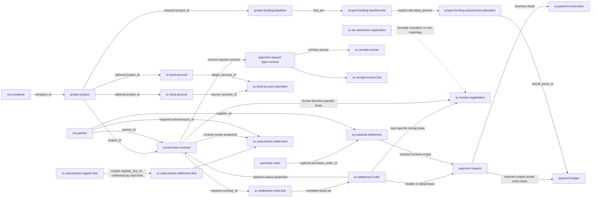

# UM-P3 S01 Core Domain Relationship Map

Authoritative matrix:
[`um_p3_s01_core_domain_authority_matrix_v1.json`](um_p3_s01_core_domain_authority_matrix_v1.json)

Chinese:
[`um_p3_s01_core_domain_relation_map_v1.md`](um_p3_s01_core_domain_relation_map_v1.md)

## Position

- Phase: `UM-P3-BUSINESS-CLOSURE`
- Slice: `UM-P3-S01-CORE-DOMAIN-AUTHORITY-BASELINE`
- Baseline: `3af4f0e312155cf837fe2c9b2228526011f898e4`
- Authority source: `USER_DECISION_2026-07-25`
- Boundary: the P2 S01-S05 authorities are frozen unchanged. This slice changes no
  business model, permission, data, or frontend behavior.

## Relationship map

Solid edges represent formal repository fields. Dashed edges are explicit gaps or formal
exclusions. A shared project, name, amount, date, order, or historical similarity is never
a relationship.

The machine values for settlement remain
`SETTLEMENT_CONTRACT_AUTHORITY=MULTI_CONTRACT_DETAIL_SET` and
`SETTLEMENT_HEADER_CONTRACT_ROLE=OPTIONAL_UNIQUE_CONTRACT_PROJECTION`.

## Closure status

| Chain | Status | Finding |
| --- | --- | --- |
| CONTRACT_TO_SETTLEMENT | CLOSED | Detail contract set is authoritative; multiple contracts are preserved |
| SETTLEMENT_TO_PAYMENT_REQUEST | CLOSED | Request details first, exclusive header fallback |
| PAYMENT_REQUEST_TO_PAYMENT_EXECUTION | CLOSED | Request is the basis; actual payee is independent |
| CONTRACT_TO_RECEIPT_REQUEST | CLOSED | Receive request uses a formal income contract |
| RECEIPT_REQUEST_TO_RECEIPT_EVENT | CLOSED | Receive request is the primary anchor |
| SETTLEMENT_OR_CONTRACT_TO_INVOICE | CLOSED | Source-kind-specific strong relation |
| PROJECT_TO_FUND_PLAN | CLOSED | Project relation, active uniqueness, caller visibility, and company boundary are proven |
| FUND_PLAN_TO_ACTUAL_FUND_EVENT | CLOSED | Explicit amount-bearing allocations connect plan lines to occurred payment facts |
| COUNTERPARTY_ACROSS_CONTRACT_SETTLEMENT_PAYMENT_INVOICE | CLOSED | Counterparty authority is closed across standard, material-procurement, and subcontract-contract paths |
| COMPANY_BOUNDARY_ACROSS_ALL_CHAINS | CLOSED | Company boundaries are proven across P2, funding, material procurement, and subcontract relations |
| SUBCONTRACT_REGISTER_TO_SETTLEMENT | PARTIAL | Explicit register authority and the `confirmed` quantity hard limit are closed; a common amount basis and source-proven historical remediation remain separate gaps |
| TAX_DEDUCTION_RELATION_MODELING | OUT_OF_SCOPE | Awaiting separate tax authority decision |

## S02 authority and next gap

S02 closes `FUND_PLAN_TO_ACTUAL_FUND_EVENT`: a
`project.funding.baseline.line` is the planned budget bucket, `payment.ledger` is the occurred
payment fact in this slice, and `project.funding.actual.event.allocation` carries the explicit
positive amount for the many-to-many attribution. Events may remain unallocated. No relation
is inferred from the active plan, a shared project, or a request relation.

S03 closes `PROJECT_TO_FUND_PLAN`: caller-visible project search resolves the relation,
ordinary finance users follow project responsibility/follower scope, and finance managers are
shared only within allowed companies. Hidden and nonexistent projects are observably equivalent
on create and write.

S04 closes the material-settlement procurement relation with
`sc.material.settlement.purchase.scope` at material-settlement-line to purchase-order-line grain.
The purchase-line project (falling back only to the purchase order's formal project) and the
purchase-order supplier are authoritative. The complete scope set must converge on one company,
project, and supplier. Multiple purchase orders remain lossless, while the scalar header purchase
order is projected only for a unique order. No project, supplier, amount, date, or name matching
is used.

S05 establishes `EXPLICIT_REGISTER_RELATION_SET` through
`sc.subcontract.settlement.line.register_line_id`. The complete register-line set must converge
on one contract, project, counterparty, and company. Multiple registrations and split settlements
remain lossless; the scalar header registration is projected only when unique. An empty relation
does not trigger project, counterparty, contract, quantity, amount, or date matching, and isolated
ORM tests prove caller visibility boundaries.

S06 closes `CORE-033-SUBCONTRACT-REGISTER-CUMULATIVE-SETTLEMENT-POLICY` under
`HARD_LIMIT_ON_FORMALLY_COMPARABLE_REGISTERED_QUANTITY`. Register-line `contract_qty` is the
quantity cap and settlement-line `qty` is the current settled quantity. Only the real
`confirmed` state counts; `draft`, `submitted`, and `cancel` are excluded. Both sides expose
only free-text `unit_name`, so effective settlement requires identical nonempty units and never
guesses a conversion. Comparison uses the formal `Product Unit of Measure` precision, while
register-line locking and row-version conflict handling prevent concurrent over-settlement.

Register `registered_amount` and tax-inclusive settlement `amount_total` still lack a common tax,
currency, pricing, and adjustment basis:
`AMOUNT_CUMULATIVE_CONTROL=DEFERRED_PENDING_COMMON_VALUATION_BASIS`. No amount hard limit or false
remaining amount is created. Upgrade does not infer empty historical relations. Source-proven
historical remediation remains the highest-priority gap
`CORE-035-SUBCONTRACT-HISTORICAL-REGISTER-RELATION-REMEDIATION`; its migration policy remains
open. S07A obtained authorized sources and an isolated target but found no historical relation
key proven at register-line grain.

## S07A source-profile conclusion

The same-capture-time LEGACY_SOURCE_A and LEGACY_SOURCE_B strict evidence packages were verified read-only, and the
current target modules were installed in a dedicated isolated database. LEGACY_SOURCE_A has no subcontract
register or settlement surface. LEGACY_SOURCE_B contains 86 subcontract contracts, 721 register-line
captures, and 88 settlement captures. The exclusive classification is:

- `EXACT_AUTHORITATIVE_KEY_COUNT=0`
- `UNIQUE_COMPOSITE_BUSINESS_KEY_COUNT=0`
- `AMBIGUOUS_COUNT=76`
- `CONFLICTING_COUNT=12`

All 12 superficial settlement-`pid` to register-`RowIndex` matches cross project boundaries, and
11 also cross counterparty boundaries, proving that this is a false relation. The remainder can
only be selected by shared project, counterparty, contract, or other business attributes and
therefore remains `AMBIGUOUS`. Current state is:

S07A-C generated one review item for every one of the 88 records: 76 remain `PENDING`, 12
conflicts remain `ESCALATED/REQUIRE_SOURCE_DOCUMENT`, and the authorized-final count is zero.
All candidate references, anchors, and evidence are irreversible digests; no candidate is ranked,
recommended, or pre-confirmed. Current state is:

`CORE_035_EXECUTION_STATE=S07AC_CONFIRMATION_SET_READY`

This neither closes nor downgrades historical remediation. S07B remains unapproved and no
migration was executed. The unique next decision is:

`ASSIGN_AUTHORIZED_BUSINESS_OWNER_DATA_STEWARD_AND_SECOND_REVIEWER`

Following formal approval, `CORE-020-PAYMENT-LEDGER-REQUEST` is closed.
`payment_request_id` is the required and SQL-unique authority relation. The finance-manager
specific `payment.ledger` rule was tightened from unconditional `ALL` to:

`PAYMENT_REQUEST_COMPANY_IN_ALLOWED_COMPANY_IDS`

That is, `payment_request_id.company_id in company_ids`. Isolated ORM proof covers A-only,
B-only, A+B, search, search_count, direct-ID reads, mixed batches, company-context switching,
and create/write/unlink. The approval is limited to the model-specific rule:
`UM_P3_CORE_020_PAYMENT_LEDGER_ALLOWED_COMPANY_RECORD_RULE`; no ACL, other record rule, or
public permission framework changed.

The formal decision
`UM_P3_CORE_034_SUBCONTRACT_CUMULATIVE_AMOUNT_VALUATION_BASIS` closes CORE-034.
Amount accumulation now uses:

- `COMMON_VALUATION_CURRENCY=SUBCONTRACT_CONTRACT_CURRENCY`
- `COMMON_TAX_BASIS=TAX_INCLUDED`
- `HARD_LIMIT_ON_EFFECTIVE_TAX_INCLUDED_AMOUNT_IN_SUBCONTRACT_CONTRACT_CURRENCY`

Register states `active/closed` and settlement state `confirmed` consume capacity; draft and
cancelled facts do not. Register and settlement currency must exactly equal contract currency,
with no implicit FX, and comparison uses authoritative currency rounding. Contract-to-register,
contract-to-settlement, and explicit `register_line_id` register-to-settlement limits are
revalidated on final effective state, batch writes, and concurrent transactions. The current
model prohibits negative registered amount, settlement quantity, and unit price, so no formal
signed reversal anchor exists and no reversal semantics were invented.

After reranking and excluding only source-evidence blocker CORE-035, there are zero safe candidates.
The unique next input is:

`ASSIGN_AUTHORIZED_BUSINESS_OWNER_DATA_STEWARD_AND_SECOND_REVIEWER`

## Architecture boundary

- Formal Product Layer: P1 construction-industry relationship governance.
- S01 carrier: P4 audit documents and machine validator.
- S02 carrier: P1 product models, minimal permission declarations, isolated ORM proof, and P4 audit.
- S04 carrier: P1 formal purchase-scope model, minimal material permissions, isolated ORM proof,
  and P4 audit.
- S05 carrier: P1 formal subcontract-settlement-line to subcontract-register-line relation,
  isolated ORM proof, and P4 audit.
- S06 carrier: quantity accumulation, real-state mapping, register-line-grain concurrency control,
  isolated ORM proof, and P4 audit on the existing explicit relation.
- S07A profile carrier: P4 machine matrix, content-addressed source profile, isolated target, and
  remediation plan; no product, permission, or existing-business-data change.
- S07A-C carrier: 88 sanitized manual-review items, an unsigned authorization template, and a
  dual-review validator; it emits no migration mapping and changes no business relation.
- CORE-020 carrier: the P1 finance-manager-specific `payment.ledger` record rule and P4 isolated
  permission proof; no ACL, other rule, or public permission framework change.
- CORE-034 carrier: tax-included contract-currency cumulative amount constraints on existing P1
  subcontract contract, register, and settlement fields; no schema, migration, ACL, record rule,
  inferred FX, or inferred tax semantics.
- S02 does not change historical data, request/approval/amount/tax/accounting authority,
  frontend, fixtures, or Docker.
