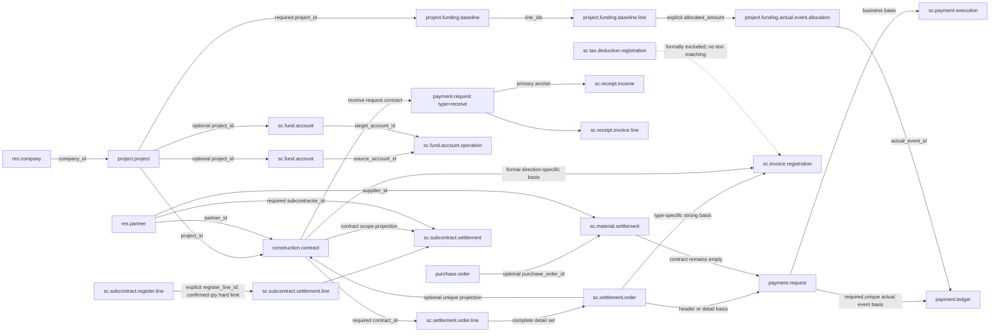

# UM-P3 S01 核心领域关系总图

权威矩阵：
[`um_p3_s01_core_domain_authority_matrix_v1.json`](um_p3_s01_core_domain_authority_matrix_v1.json)

English:
[`um_p3_s01_core_domain_relation_map_v1.en.md`](um_p3_s01_core_domain_relation_map_v1.en.md)

## 定位

- 阶段：`UM-P3-BUSINESS-CLOSURE`
- 切片：`UM-P3-S01-CORE-DOMAIN-AUTHORITY-BASELINE`
- 基线：`3af4f0e312155cf837fe2c9b2228526011f898e4`
- 权威来源：`USER_DECISION_2026-07-25`
- 事实边界：P2 S01～S05 的权威原样冻结；本切片不修改业务模型、权限、数据或前端。

## 总图

实线只表示仓库中存在的正式字段；虚线表示明确缺口或正式排除。共同项目、同名、金额、
日期或历史相似性都不构成关系。

## P2 已冻结权威

| 范围 | 权威 | 投影/消费者 | 状态 |
| --- | --- | --- | --- |
| 收款 | `payment.request(type=receive)` 为主锚，正式收入合同为次锚 | `sc.receipt.income` | CLOSED |
| 付款 | 付款申请完整明细集合优先，否则唯一标准/材料结算头 | `sc.payment.execution` | CLOSED |
| 资金往来 | 转出、转入账户是两个端点权威 | 项目及相对端投影 | CLOSED |
| 发票 | 按 `source_kind` 使用可见结算或方向正确的正式合同 | 发票合同、项目、往来单位 | CLOSED |
| 结算 | 完整有效结算明细合同集合 | 唯一合同时的可选头部合同 | CLOSED |
| 抵扣登记 | 未批准合同/发票关系建模 | 无投影 | OUT_OF_SCOPE |

结算的机器权威值冻结为
`SETTLEMENT_CONTRACT_AUTHORITY=MULTI_CONTRACT_DETAIL_SET`，头部角色冻结为
`SETTLEMENT_HEADER_CONTRACT_ROLE=OPTIONAL_UNIQUE_CONTRACT_PROJECTION`。

## 闭环状态

| 闭环 | 状态 | 结论 |
| --- | --- | --- |
| CONTRACT_TO_SETTLEMENT | CLOSED | 明细合同集合权威，多合同不压缩 |
| SETTLEMENT_TO_PAYMENT_REQUEST | CLOSED | 付款申请明细优先、唯一头部兜底 |
| PAYMENT_REQUEST_TO_PAYMENT_EXECUTION | CLOSED | 申请为业务依据，实际收款方可独立 |
| CONTRACT_TO_RECEIPT_REQUEST | CLOSED | 收款申请使用正式收入合同 |
| RECEIPT_REQUEST_TO_RECEIPT_EVENT | CLOSED | 收款申请为主锚 |
| SETTLEMENT_OR_CONTRACT_TO_INVOICE | CLOSED | 发票类型分派强关系 |
| PROJECT_TO_FUND_PLAN | CLOSED | 项目字段、单一生效约束、调用者可见性与公司边界均已证明 |
| FUND_PLAN_TO_ACTUAL_FUND_EVENT | CLOSED | 计划明细与实际付款事实通过显式带金额分配关系闭合 |
| COUNTERPARTY_ACROSS_CONTRACT_SETTLEMENT_PAYMENT_INVOICE | CLOSED | 标准、材料采购和分包合同链的往来单位权威均已闭合 |
| COMPANY_BOUNDARY_ACROSS_ALL_CHAINS | CLOSED | P2、资金、材料采购和分包关系均已证明公司边界 |
| SUBCONTRACT_REGISTER_TO_SETTLEMENT | PARTIAL | 显式登记关系与 `confirmed` 数量累计硬上限已闭合；金额共同计价基础及有来源证据的历史关系修复保持独立缺口 |
| TAX_DEDUCTION_RELATION_MODELING | OUT_OF_SCOPE | 等待独立税务权威决策 |

## S02 权威与下一缺口

S02 已将 `FUND_PLAN_TO_ACTUAL_FUND_EVENT` 闭合：

- `project.funding.baseline.line` 是计划预算桶；
- `payment.ledger` 是本切片确认的实际付款事实；
- `project.funding.actual.event.allocation` 以正金额承载多对多归属；
- 实际事件允许未分配，不从当前生效计划、共同项目或申请关系推断；
- 分配总额不得超过实际事件金额，计划额度仅提供非阻断投影。

S03 已闭合 `PROJECT_TO_FUND_PLAN`：资金基准通过调用者可见项目搜索解析关系，普通
财务用户按项目负责/关注可见，财务经理按允许公司共享；隐藏与不存在项目在 create/write
中保持可观察等价。

S04 已以 `sc.material.settlement.purchase.scope` 闭合材料结算与采购关系。关系粒度为
材料结算明细到采购订单明细，采购行项目（缺失时使用采购单正式项目）和采购单供应商
是采购范围权威；完整范围必须收敛到同一公司、项目和供应商。多采购订单事实完整保留，
头部 `purchase_order_id` 仅在唯一采购单时投影，不按项目、供应商、金额或日期匹配。

S05 以分包结算明细的 `register_line_id` 建立
`EXPLICIT_REGISTER_RELATION_SET`。完整登记明细集合必须收敛到同一合同、项目、往来单位
和公司；多登记与分次结算均完整保留，头部登记仅在唯一登记时投影。关系为空时不按项目、
往来单位、合同、数量、金额或日期自动匹配，所有调用者边界均由隔离 ORM 验证。

S06 按正式决策关闭
`CORE-033-SUBCONTRACT-REGISTER-CUMULATIVE-SETTLEMENT-POLICY`，固定策略为
`HARD_LIMIT_ON_FORMALLY_COMPARABLE_REGISTERED_QUANTITY`：

- `contract_qty` 是登记明细数量上限，`qty` 是本次结算数量；
- 只有真实状态 `confirmed` 计入累计，`draft`、`submitted`、`cancel` 不计入；
- 登记与结算只有自由文本 `unit_name`，因此只允许非空且完全一致的单位，不猜测换算；
- 校验按 `Product Unit of Measure` 精度比较，并在登记明细粒度加锁；并发版本冲突转为明确业务错误；
- `registered_amount` 与含税 `amount_total` 没有共同税、币种、计价及调整基础，固定为
  `AMOUNT_CUMULATIVE_CONTROL=DEFERRED_PENDING_COMMON_VALUATION_BASIS`，不形成金额硬上限或虚假剩余金额。

升级不推断历史空关系。有来源证据的历史关系修复保留为最高优先级
`CORE-035-SUBCONTRACT-HISTORICAL-REGISTER-RELATION-REMEDIATION`；迁移政策保持开放。
S07A 已取得授权来源和隔离目标，但没有发现可证明到登记明细粒度的历史关系键。

## S07A 来源画像结论

LEGACY_SOURCE_A 与 LEGACY_SOURCE_B 的同时间点严格采集包已经只读核验，当前目标模块也已安装到专属隔离库。
LEGACY_SOURCE_A 没有分包登记或分包结算业务面；LEGACY_SOURCE_B 包含 86 条分包合同、721 条分包方单明细和
88 条分包结算单。关系分类结果为：

- `EXACT_AUTHORITATIVE_KEY_COUNT=0`
- `UNIQUE_COMPOSITE_BUSINESS_KEY_COUNT=0`
- `AMBIGUOUS_COUNT=76`
- `CONFLICTING_COUNT=12`

结算 `pid` 与登记 `RowIndex` 的 12 个表面命中全部跨项目，其中 11 个还跨往来单位，
所以该组合是确定的伪关联。其余仅能通过项目、往来单位、合同等属性形成候选，按既定
政策全部保持为 `AMBIGUOUS`，不能升级为强关系。当前状态冻结为：

S07A-C 已将全部 88 条记录生成独立审核项：76 条保持 `PENDING`，12 条冲突保持
`ESCALATED/REQUIRE_SOURCE_DOCUMENT`，最终确认数为 0。候选引用、锚点和证据均为不可逆
摘要；没有候选排序、推荐或预填确认。当前状态为：

`CORE_035_EXECUTION_STATE=S07AC_CONFIRMATION_SET_READY`

这不关闭或降级历史治理；S07B 仍未批准，也没有执行迁移。唯一下一决定是：

`ASSIGN_AUTHORIZED_BUSINESS_OWNER_DATA_STEWARD_AND_SECOND_REVIEWER`

经正式批准，`CORE-020-PAYMENT-LEDGER-REQUEST` 已闭合。`payment_request_id` 为
必填且 SQL 唯一的权威关系；财务经理的 `payment.ledger` 专属规则由无条件 `ALL`
收紧为：

`PAYMENT_REQUEST_COMPANY_IN_ALLOWED_COMPANY_IDS`

即 `payment_request_id.company_id in company_ids`。隔离 ORM 证明 A-only、B-only、
A+B、search、search_count、直接 ID 读取、混合批次、公司上下文切换及 create/write/unlink
均服从请求侧公司边界。授权范围仅限该模型专属规则：
`UM_P3_CORE_020_PAYMENT_LEDGER_ALLOWED_COMPANY_RECORD_RULE`；ACL、其他 record rule
及公共权限框架未改变。

正式决定 `UM_P3_CORE_034_SUBCONTRACT_CUMULATIVE_AMOUNT_VALUATION_BASIS`
已将 CORE-034 闭合。金额累计采用：

- `COMMON_VALUATION_CURRENCY=SUBCONTRACT_CONTRACT_CURRENCY`
- `COMMON_TAX_BASIS=TAX_INCLUDED`
- `HARD_LIMIT_ON_EFFECTIVE_TAX_INCLUDED_AMOUNT_IN_SUBCONTRACT_CONTRACT_CURRENCY`

登记的 `active/closed` 与结算的 `confirmed` 状态计入累计；取消和草稿不计入。
登记与结算币种必须精确等于合同币种，不使用隐式汇率；比较使用权威币种 rounding。
合同对登记、合同对结算，以及显式 `register_line_id` 关系上的登记对结算金额上限均在
最终有效状态、批量写入和并发事务中重验。当前模型禁止负登记金额、负结算数量和负单价，
所以“正式有符号冲销”没有可适用模型锚点，未新造冲销语义。

重排后，排除唯一来源证据阻塞 CORE-035，安全候选数为 0。唯一下一输入是：

`ASSIGN_AUTHORIZED_BUSINESS_OWNER_DATA_STEWARD_AND_SECOND_REVIEWER`

## 架构边界

- Formal Product Layer：P1 施工行业标准产品的业务关系治理。
- S01 载体：P4 审计文档与机器 validator。
- S02 载体：P1 行业产品模型、最小权限声明、隔离 ORM 证明和 P4 审计。
- S04 载体：P1 正式采购范围模型、最小材料权限声明、隔离 ORM 证明和 P4 审计。
- S05 载体：P1 分包结算明细到分包登记明细的正式强关系、隔离 ORM 证明和 P4 审计。
- S06 载体：既有明细关系上的数量累计、状态映射、登记明细粒度并发控制、隔离 ORM 证明和 P4 审计。
- S07A 画像载体：P4 机器矩阵、内容寻址来源画像、隔离目标和修复计划；不修改产品、
  权限或既有业务数据。
- S07A-C 载体：88 条脱敏人工确认事项、未签署授权模板和双审 validator；不输出迁移
  映射，不修改任何业务关系。
- CORE-020 载体：P1 `payment.ledger` 财务经理专属 record rule 与 P4 隔离权限证明；
  不修改 ACL、其他规则或公共权限框架。
- CORE-034 载体：P1 既有分包合同、登记和结算字段上的含税合同币种累计金额约束；
  不新增 schema、迁移、ACL、record rule、汇率或税率推断。
- S02 未修改历史数据、申请/审批/金额/税务/会计权威、前端、fixture 或 Docker。
