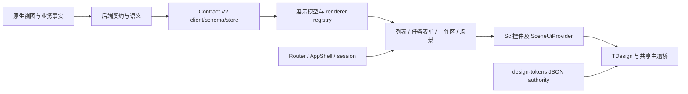

# 自定义前端整体分析与迭代策略

日期：2026-09-09。状态：分析完成，策略待实施；不是全系统验收或发布报告。

## 1. 结论与本轮边界

当前前端已有契约驱动、通用表单、列表、主题、组件适配、权限与状态保护等基础，付款申请也已有独立业务闭环证据。下一阶段的主要缺口是统一的产品表达和连续任务体验，而不是继续增加控件、入口或业务流程。

此前逐点修复焦点、边框、按钮尺寸确实改善了局部质量，但以这些修复作为每轮交付单位，不能解决首页、工作事项、列表、详情之间的整体差异。后续以“一个完整页面类型或任务旅程”作为交付单位，控件修复成为该交付内部的子任务。

目标：让使用者在不同页面保持相同的定位方式、阅读顺序、动作预期和反馈方式。优先打磨付款申请既有旅程，不新增其他业务流程。

- 仓库：`/home/lidefend/workspace/sce-backend-odoo`。
- 分支：`feature/frontend-page-experience-iteration-v1`。
- 被审产品 HEAD：`3d3975b3d45c1462677df0abcbb5708e4b53e0b1`；开始时工作区干净。
- 完整基线指纹：`c243b67e2b4bbb5700a3a4a2d7a36cd7546a6390c131b00fb7a27831fca78e05`，7321 路径。
- 本轮只读分析产品代码与浏览器，唯一新增文件为本报告；未修改产品代码、契约、业务数据或运行环境。
- 报告归属 P4 / docs/ops：记录现状、证据和执行策略，不承担运行时产品规则。未来通用表达改动归 P0；行业事实及默认业务语义归 P1，客户确认的偏好归 P2，管理员显式调整归 P3。
- 浏览器为既有 local.dev 会话，页面显示“系统管理员 / My Company”。该显示身份不等于已验证其他业务角色或 fixture 身份。

“全量分析”在本报告中指全前端目录盘点、入口与页面类型覆盖、核心链路检查和跨页面体验分析；不是声称对每行代码、404 个配置目录条目、全部角色和全部业务状态进行了逐一运行验收。

## 2. 全局代码地图

按 `.vue/.ts/.js/.css` 文件统计，未将 node_modules、构建产物或文档作为 Web 源码计数：

| 范围 | 当前规模 | 作用及判断 |
| --- | --- | --- |
| apps/web/src | 698 文件：216 Vue、437 TS、38 CSS、7 JS | 当前自定义 Web 产品主体 |
| Web app/ | 243 文件 | 契约、展示模型、导航和 Action 运行时；机制已较丰富 |
| Web components/ | 193 文件 | 基础适配、页面模式、列表、字段、工作事项等 |
| Web pages/ | 139 文件 | 通用 ListPage、ContractForm 及其渲染与交互拆分 |
| Web views/ | 61 文件 | 路由视图、Scene、Action、登录、首页、工作台与配置页 |
| packages/ui/src | 28 文件 | 场景组件、驱动注册、TDesign 主题桥；与 Web 的 Sc* 适配层有分工 |
| packages/schema/src | 1 文件 | 共享 schema 类型入口 |
| packages/design-tokens | JSON 源、构建脚本、生成 CSS/TS | 已有单一 token authority，不能另起一套颜色与尺寸体系 |
| apps/mobile | 独立 uni-app 入口；注册 login/home/contract 三个页面 | 与 Web 窄屏是两个产品载体，本轮仅源码检查 |

当前大型文件包括 ActionView.vue 3769 行、ListPage.vue 2107 行、session.ts 1933 行、ContractFormPage.vue 1857 行、SceneView.vue 1708 行、AppShell.vue 1596 行、AppShell.css 1224 行、配置样式 1741 行。它们说明改动影响面需要管理，但不能仅凭行数判定代码失效，也不应把纯拆文件作为下一阶段的产品成果。

### 核心链路

源码锚点：

- `frontend/apps/web/src/router/index.ts`：全部 Web 路由、别名、活动页与权限前置逻辑。
- `frontend/apps/web/src/app/contracts/v2/client.ts`、`schema.ts`、`store.ts`、`runtime.ts`：契约获取、解码、规范化与执行计划。
- `frontend/apps/web/src/app/renderers/actionSurfaceRendererRegistry.ts`：集合渲染器的真实就绪/回退状态。
- `frontend/apps/web/src/pages/contractForm/ContractFormDriverHost.vue`：规范化表单模型进入 SceneUiProvider、TaskFormPattern、WorkspaceFormPattern。
- `frontend/apps/web/src/app/presentation/professionalComponentRegistry.ts`：字段语义到组件的注册，包含 fail_closed/readable_fallback 的边界。
- `frontend/packages/design-tokens/token-authority.json` 与 Web `styles/tokens/index.css`：原始、语义、组件、模式 token 分层。

## 3. 页面类型与实际覆盖

| 类型 | 实现入口 | 本轮证据 | 结论边界 |
| --- | --- | --- | --- |
| 登录、激活、找回密码 | LoginView / AccountActivationView / PasswordRecoveryView | 路由盘点及登录模板源码 | 不退出原会话，本轮没有认证旅程重验 |
| 系统外壳 | AppShell / ProductAppShell / ActivityPageTabs | 多路由桌面与窄屏截图、DOM、几何读取 | 存在同页别名布局差异；菜单全角色覆盖未验 |
| 首页 | HomeView → ScPage → WorkspaceHome | `/`、`/s/workspace.home`，1088/1440/390 视口 | 任务摘要可用，密度和信息重复仍明显 |
| 我的工作 | MyWorkView / MyWorkApprovalWorkspace | 桌面四条待办，沿“打开详情”进入记录 | 卡片逐项展开，首屏办理效率不足；未提交动作 |
| 标准集合 | ActionView → CollectionPattern → ListPage | 付款列表 70 条，1440 与 390 视口 | 能用，但桌面识别列过窄，移动单条卡片偏高 |
| 任务详情 | ContractFormRoute / DriverHost / ObjectTaskPage | SHOW-PR-04 桌面和 390 稳定详情 | 已有摘要/任务/上下文分区；信息优先级与数值表达未统一 |
| 创建、编辑与关系 | ContractForm / ProfessionalRelation / X2Many / Dialog | 入口、组件与既有验收记录检查 | 本轮不创建/保存，不能把先前候选证据当本轮重验 |
| 层级工作区 | HierarchicalWorksheet / HierarchyTreeNode | 收入合同 46 条，桌面截图与 DOM | 三分区成立，但树、表、详情、页面各自滚动，搜索表达不同 |
| 图表、透视、活动 | Action registry / ChartDatasetPanel / 相关 adapter | 注册表与代码入口 | 不等于全部数据集或角色已验收 |
| calendar/gantt/dashboard 集合语义 | Action registry | 源码明确标记 fallback → core.readable_records | 不应宣称已有完整日历/甘特/集合仪表盘；与专门的首页页面不是同一概念 |
| 配置/运营 | BusinessConfigSurface 等 admin 路由 | 配置台只读截图、DOM、状态组件源码 | 接入规模大，信息负担重；不扩展为配置能力重构 |
| 独立移动端 | apps/mobile | pages.json、首页与入口源码 | 首页仍展示服务地址、数据库等技术信息；无本轮运行验证，不与 Web 390px 混为一谈 |

浏览器截图直接记录于本次任务工具输出，没有另存成独立截图证据包。以下引用为本轮实测观察；代码原因与待验证推断分别说明。

## 4. 主要发现与根因

### F1：相同首页因路由别名出现不同外壳

实测：1440px 下 `/` 顶栏 52px；`/s/workspace.home` 顶栏 66px。1088px 正式首页顶栏出现换行，整体高度更大。页面内容同为 WorkspaceHome。

代码：AppShell.vue 的 `useMinimalTopbar` 包含 `home`，未包含 `scene-home`；`businessRouteUsesCompactTopbar` 仅覆盖 scene/action/record/model-form。路由名称决定外壳，而不是统一页面类型。这是系统性一致性问题，优先级高于局部边框。

策略：以同一语义页面身份决定顶栏、标题归属和密度；保留现有路由授权和菜单 authority，不做导航重构。

### F2：首页与业务页采用不同空间语言

实测：首页为外面板、分区标题线、内部任务卡片、内部汇总卡片多层叠加；付款列表则是轻边界连续表面。首页 1440px 右侧两项计数占一个大列，下方留下明显空白；常用入口被长列表推到首屏以下。

代码：WorkspaceHome 自定义 scoped grid、panel borders、task article；HomeView 没有消费现有 DashboardPattern。DashboardPattern 本身目前主要提供网格和 gap，并未定义首页信息槽位。不能靠加一个 wrapper 就宣称完成首页产品化。

策略：先定义全局表面、标题、间距、页头槽位的使用规则，再让现有页面类型消费。采用“页面背景—主要工作表面—局部分隔”三个层次，同一内容不连续叠加装饰边框。

### F3：事项身份、状态、金额与明细重复，任务扫描效率低

实测：首页三条事项标题都为“付款申请”，真正记录标识在组合描述末尾；项目、金额又在其他位置重复。我的工作同一条记录显示完整拼接标题，再展开八项事实；1440×900 首屏仅完整显示一条事项卡。移动付款列表单条记录约占三百像素以上。

代码：`useWorkspaceHome.taskLink` 同时映射 business_type、record.label、facts、amount；MyWorkApprovalWorkspace 将 `item.facts` 全量送入 ScDescriptions。当前所用事实已经有 `field_group` 与 `display_role`，可据此设计紧凑摘要及可展开辅助信息，不能按字符串猜字段含义或直接删事实。

策略：一个一致的事项身份区，接一行关键事实与状态，提供清楚的主动作；审计信息按既有语义折叠、随时可达。若 record.label 缺少结构化身份字段，登记上游契约依赖，不在前端按斜杠拆字符串。

### F4：列表“全部装得下”不等于“关键内容读得清”

实测：1440px 付款表宽 1145px，单据编号约 137px、项目约 133px、收款单位约 141px，多数长名称省略。移动卡片保留了事实，但缺少针对快速查找任务的层次。

策略：建立通用列角色的最小可读宽度和溢出规则，优先识别列与数字对比。保留契约列可见性和排序权限；默认列内容的行业变更属于 P1，不以 CSS 隐藏代替。移动端采用关键事实摘要 + 明确展开，确保完整值可访问，不把“无横向溢出”作为唯一标准。

### F5：详情有分区，但跨页事实表达仍不一致

实测：SHOW-PR-04 的相同金额在首页/我的工作为 `¥50.00 CNY`，详情为 `50`。移动详情先展示当前任务和阻断文字，申请金额位于更靠后的摘要行，首屏不可见。“阻断付款执行”与“档案有效，可正常发起业务”以接近的普通文字层级显示。

代码：ScMoney 只接受 display，负责排版而不负责统一金额格式；WorkspaceHome 自行 formatFact，ProfessionalBusinessValueControl 使用 field.digits/currencyLabel。格式差异的最终原因需核对该记录的契约元数据，不能先假定币种或两位精度。详情已有 floorplan 分类，需沿用其语义而非前端新增支付判断。

策略：统一格式化入口及输入要求；依靠契约的风险、范围、状态语义分组展示。“阻断哪个阶段”必须可辨识，不能因提示含“阻断”就错误禁用提交。首屏同时支持识别记录、核对核心金额、看清当前动作。

### F6：共享底层控件不保证完整交互模式一致

实测：付款列表搜索融合在工具条，收入合同使用独立全宽输入和外置搜索按钮；层级工作区同时包含导航树、表格、详情和页面滚动。

代码：ProductListHeader 可以被不同插槽和 aligned-layout 模式组合；HierarchicalWorksheet 自有布局、详情标签与 separator。separator 有 tabindex 与 pointerdown，源码未见等价键盘调整处理，属于未运行验证的可访问性缺口。前两批表头修复仅覆盖标准集合，不能推定覆盖这里。

策略：定义查询条、分区选择、返回和恢复状态的完整模式，并允许层级工作区保留合理的独立滚动；不是强制所有页面只有一个滚动容器。

### F7：配置工作台有不同的信息密度和状态口径

实测：配置页显示目录总数 404、当前 60，多个面板并列；DOM 同时存在“当前没有未发布修改”和“有未发布修改”。本轮未选择、发布或放弃任何配置。

代码：BusinessConfigChangeSetPanel 的 title 按 item_count 判定，statusLabel 缺失状态默认映射 draft → 有未发布修改，两者口径不同。只读证据支持状态表达矛盾，不证明后端真的存在待发布变更。

策略：配置台复用外壳、状态、控件规则，保留管理员任务所需密度；选中页面前不制造虚假的待处理状态。此问题进入后续页面类型推广队列，不抢占付款主旅程。

### F8：已有统一设计基础，但消费边界尚未收敛

代码：token authority 已存在；Sc*、Scene*、TDesign theme bridge、product-patterns、AppShell 和各页 scoped styles 分别承担不同职责。大文件与局部覆写会增加一致性维护成本，但并非全部重复代码都应删除。

策略：明确 token 定义尺寸与色义、主题桥控制第三方控件、pattern 管理页面空间与槽位、页面仅组合内容；在实际页面改造中移走冲突规则。禁止为“全系统专业化”另建 UI kit、设计 token 包或新 renderer 主链。

### F9：工程 PASS 与产品验收仍有距离

既有矩阵明确是代表性本地验收，不能覆盖当前全部页面；本轮又发现别名布局、卡片密度与配置状态问题。renderer registry 中的 ready 表示接入能力，不等于实际任务可用；fallback 必须单独标识。

源码复核：`useRecordFormActions.ts` 622 行，style_system_guard 中阈值 619；该既有门禁风险仍在。此次未执行完整 release gate，也没有把历史 PASS 重新标为当前全量结果。

性能本轮只有开发环境可见行为，没有构建产物大小、请求时延分布、交互延迟或布局偏移的定量证据。不据此声称“性能良好”或“必须性能重构”。

## 5. 总体迭代策略：三个交付阶段

### 阶段 A：系统外壳与表达基准

交付结果：首页、我的工作、付款列表、付款详情在同一系统外壳下成立，标题、内容起点、状态和动作遵守同一套规则。

先做路由等价与标题归属，再处理共享空间与表面规则。首页只做与业务页的一致性整合，不另起大屏仪表盘设计；符合 `.agent/decisions/frontend-product-priority.yaml` 的列表/表单优先原则。

### 阶段 B：付款申请完整用户体验样板

交付结果：从首页/我的工作进入付款列表或记录，识别、查找、查看、返回及已有状态表达形成连续体验。围绕同一个记录对照各入口，不用不同记录掩盖事实与格式不一致。

覆盖查询、无结果恢复、分页/排序状态保留、桌面/窄屏详情、当前动作、业务提示、草稿保护。业务提交/审批/支付机制保持现有权威；若实现改动碰到动作执行链，必须明确提高验证范围，不能以只读检查代替业务回归。

### 阶段 C：按页面类型推广并形成完整验收矩阵

交付结果：标准集合、层级工作区、任务表单、工作区表单、工作首页、状态页、配置页都明确“统一规则 + 合理差异 + 实际证据”。收入合同仅作为层级类型代表，不扩展其业务流程。

独立移动端和 fallback 日历/甘特等记录为后续产品能力，不在本轮顺势扩建。主题和响应式随每个阶段验证，不留到全部改完后补测。

## 6. 可直接执行的任务清单与验收标准

以下为后续候选的验收目标，尚未实施或全部达成；视觉数值作为项目内部基准，不代表引用外部标准或既有契约值。

| 任务 | 范围/归属 | 具体交付 | 验收标准 | 依赖 |
| --- | --- | --- | --- | --- |
| A1 页面身份与外壳统一 | P0：router、AppShell、page identity | 等价路由使用同一布局判定；固定标题归属 | `/` 与 `/s/workspace.home` 同视口顶栏高度/内容起点一致；各页只有一个可见 h1；活动页标题与当前记录对应；未保存保护不变 | 无 |
| A2 页面表达基准 | P0：既有 token/bridge/pattern | 一套页头、工作表面、分区、操作区规则；去除连续装饰边框 | 1440/1088 下四个样板页内容左右基准一致；320/390 无根文档横向溢出；单层焦点；同类输入和动作尺寸一致，窄屏主操作至少 44px 高 | A1 |
| B1 事项摘要与工作列表 | P0 先消费已有 facts；缺少事实单列上游依赖 | 统一记录身份与摘要，辅助/审计信息渐进展开 | 1440×900 我的工作至少可完整扫描 3 条紧凑事项；每条可识别记录、状态、关键金额和动作；所有原事实仍能展开访问；不解析拼接标题推断业务字段 | A2 |
| B2 标准集合工作模式 | P0：ListPage、ProductListHeader、CollectionRowCell | 统一查询条、可读列宽、选中/分页/返回恢复 | 付款列表 70→筛选→0→清除恢复；打开记录再返回，查询/排序/页码保持；长编号与往来单位可取完整值；金额对齐；移动卡片可展开全部事实 | A2 |
| B3 详情决策表达 | P0 floorplan/value formatter；事实缺口归原层 | 同记录跨页格式统一、关键摘要与阶段提示分层 | SHOW-PR-04 跨首页/工作/详情金额值及币种/精度遵从同一权威输入；390 首屏可见记录身份、关键金额和当前动作；阻断阶段不混淆；最多一个启用的主要业务动作 | B1/B2 |
| B4 交互反馈闭环 | P0：现有状态/表单/关系/确认组件 | 查询、加载、错误、只读、取消、草稿保护共同验收 | 真实读失败可重试；无重复动作请求；取消/Escape 保留临时输入并恢复焦点；权限不足明确解释；不把未运行分支算 PASS | B2/B3 |
| C1 层级工作区对齐 | P0：HierarchicalWorksheet | 与标准查询条和详情事实格式对齐，保留三分区特性 | 46 条合同查找与恢复；树作用域和选中项一致；分隔条鼠标/键盘均可调整；滚动归属可解释；窄屏不丢详情入口 | 阶段 B |
| C2 配置与异常页面推广 | P0 通用表达；不写 P3 配置 | 统一状态口径、标题/搜索/空态，区分业务与管理密度 | 空 changeset 不显示“有未发布修改”；未选中页不显示误导性变更；无权限/404/错误页有明确去向；无配置发布动作 | 阶段 B |
| C3 整体验收与分批交付 | P4：复用现有矩阵、Make、浏览器 | 候选绑定的覆盖表和可回滚本地批次 | 每种类型至少一个真实页面；默认主题、暗色、320/390/1088/1440；浏览器/代码/契约/环境/发布证据分开登记；无零测试冒充通过 | A/B/C 对应范围完成 |

验收还应包含“用户能否在少量阅读步骤内回答：这是什么记录、现在什么状态、关键事实是什么、下一步能做什么”。仅尺寸符合或没有控制台错误不构成整页通过。

## 7. 实施纪律与交付节奏

1. 一个阶段先定义样板页面与前后对照，再在该阶段内连续修改、验证和复核；不每修一个控件就结束整体工作。
2. 保留当前工作分支、单写入者、local.dev、现有数据库和验证入口。每批冻结 SHA/完整指纹与修改范围。
3. 不先做全仓重构。只有实际阻碍当前页面结果的样式重复、组件职责或运行时耦合才随批收敛。
4. 列表与表单保留原生结构、字段权限、状态动作、关系语义及权威回读链。不能用页面漂亮为理由修改支付机制。
5. 字段角色/币种/风险阶段等元数据不足时登记依赖：已有语义可渲染则 P0，行业语义缺失回到 P1；不在前端猜测，也不在本轮自动扩展业务工作。
6. 局部提交保留，但面向用户的进展按“阶段成果与剩余风险”报告；PR/CI/推送/合并另行登记，不暗含在本分析的授权中。

复用验证入口：`verify.frontend.typecheck.strict`、`verify.frontend.page_identity`、`verify.frontend.page_pattern_reference_parity.unit`、`verify.frontend.collection_navigation_controls.unit`、`verify.frontend.hierarchical_worksheet.unit`、`verify.frontend.state_dashboard.unit`、`verify.frontend.professional_workflow.unit`、`verify.frontend.overlay_lifecycle.unit`、`verify.frontend.theme_profile.unit`、`verify.frontend.scene_component_bridge.guard`。按变更影响选择，不机械每批全部重跑。

样式系统既有阻断与完整发布条件必须单列处理。当前本地验收不得替代 `verify.frontend.release.local` 的正式候选流程。

## 8. 本轮证据限制及下一步

- 当前确认的是产品表达问题、入口实现差异和代码结构，不是新业务缺陷审查结论。
- 本轮没有点击提交、审批、支付、关注、删除或配置发布；导航会正常增加最近访问/活动页记录。
- 本轮没有重跑正向支付全链、重复支付拒绝、其他角色权限或登录流程。
- 没有将“页面可见”推定为按钮可执行；没有将组件 registry ready 推定为完整产品体验。
- 后续第一个实施批次应是 A1+A2 的整体外壳样板，同时以付款列表和详情作对照。其完成条件是四个样板页面呈现一致，不是再消除一个局部边框。

本报告接续既有 `frontend_system_experience_batch_v1.md`，不改写其历史验收结果；上述新发现和更高层目标说明为什么既有局部 PASS 之后仍需要整体迭代。
